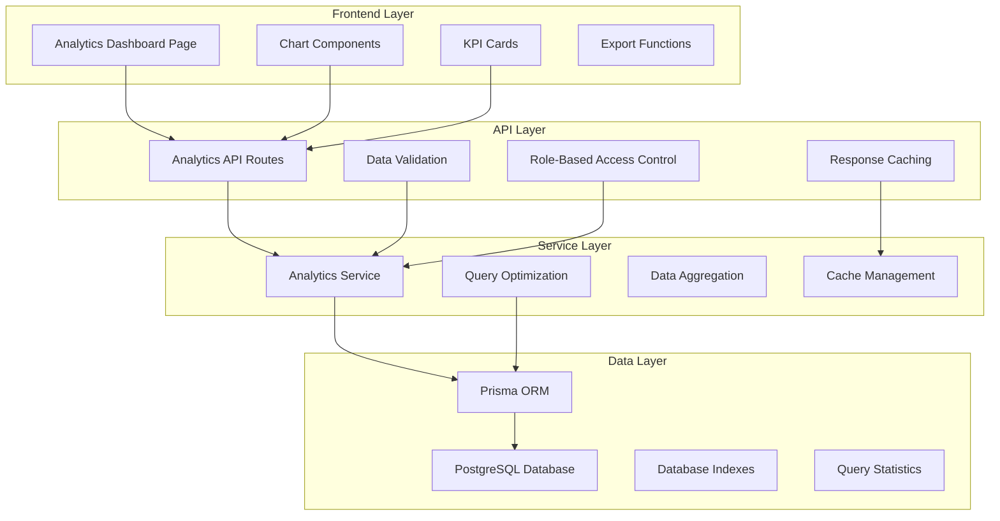

# Design Document: Advanced Analytics Dashboard

## Overview

The Advanced Analytics Dashboard is a comprehensive reporting system that transforms raw sales, inventory, and customer data into actionable business insights. The system provides eight core analytics modules with interactive visualizations, real-time data processing, and role-based access control.

The design leverages the existing Next.js 14 App Router architecture, PostgreSQL database with Prisma ORM, and integrates with the current authentication system. The solution emphasizes performance optimization through strategic caching, database query optimization, and efficient data aggregation patterns.

## Architecture

### High-Level Architecture



### Component Architecture

The system follows a layered architecture pattern:

1. **Presentation Layer**: React components with Recharts for data visualization
2. **API Layer**: Next.js API routes with caching and validation
3. **Business Logic Layer**: Analytics service with optimized query patterns
4. **Data Access Layer**: Prisma ORM with raw SQL for complex aggregations
5. **Database Layer**: PostgreSQL with strategic indexing

## Components and Interfaces

### Core Components

#### 1. Analytics Dashboard Page (`/app/dashboard/analytics/page.tsx`)

- Main dashboard container with responsive grid layout
- Date range selector with preset options (Today, Week, Month, Quarter, Year)
- Navigation tabs for different analytics modules
- Export functionality for CSV downloads
- Real-time refresh controls

#### 2. Chart Components (`/components/analytics/`)

**TopProductsChart.tsx**

- Multi-series line chart for revenue trends
- Bar chart for top products by volume/revenue
- Interactive tooltips with detailed metrics
- Drill-down capability to product details

**CategoryRevenueChart.tsx**

- Donut chart showing category revenue distribution
- Data table with sortable columns
- Percentage contribution calculations

**SalesTrendChart.tsx**

- Area chart for revenue trends over time
- Secondary line for transaction count
- Configurable time intervals (hourly, daily, weekly)
- KPI cards for key metrics

**PaymentMethodChart.tsx**

- Horizontal bar chart for payment method breakdown
- Transaction count and revenue metrics
- Payment reconciliation data

**CashierPerformanceChart.tsx**

- Leaderboard-style bar chart
- Performance metrics table
- Individual cashier drill-down

**CustomerAnalyticsChart.tsx**

- Customer ranking charts
- Purchase trend analysis with multi-line charts
- Customer status indicators (Trending Up, Slipping, At Risk)

#### 3. Service Layer (`/lib/services/analytics.service.ts`)

**Enhanced Analytics Service**

```typescript
interface AnalyticsService {
	// Product Analytics
	getTopPerformingProducts(
		params: TopProductsParams,
	): Promise<TopProductsResult>;

	// Revenue Analytics
	getRevenueSummaryByCategory(
		params: CategoryRevenueParams,
	): Promise<CategoryRevenueResult>;

	// Sales Trends
	getSalesTrends(params: SalesTrendParams): Promise<SalesTrendResult>;

	// Payment Analytics
	getPaymentMethodBreakdown(
		params: PaymentBreakdownParams,
	): Promise<PaymentBreakdownResult>;

	// Staff Performance
	getCashierPerformance(
		params: CashierPerformanceParams,
	): Promise<CashierPerformanceResult>;

	// Inventory Analytics
	getInventoryValue(): Promise<InventoryValueResult>;

	// Customer Analytics
	getTopCustomers(params: TopCustomersParams): Promise<TopCustomersResult>;
	getCustomerTrends(
		params: CustomerTrendsParams,
	): Promise<CustomerTrendsResult>;
}
```

### API Endpoints

#### RESTful API Design

**Product Analytics**

- `GET /api/analytics/products/top-performing`
- Query parameters: `startDate`, `endDate`, `categoryId`, `groupBy`, `sortBy`, `limit`

**Revenue Analytics**

- `GET /api/analytics/revenue/by-category`
- Query parameters: `startDate`, `endDate`

**Sales Trends**

- `GET /api/analytics/sales/trends`
- Query parameters: `startDate`, `endDate`, `interval`

**Payment Analytics**

- `GET /api/analytics/payments/breakdown`
- Query parameters: `startDate`, `endDate`

**Staff Performance**

- `GET /api/analytics/cashiers/performance`
- Query parameters: `startDate`, `endDate`, `userId`

**Inventory Analytics**

- `GET /api/analytics/inventory/value`
- No parameters (current state analysis)

**Customer Analytics**

- `GET /api/analytics/customers/top`
- Query parameters: `startDate`, `endDate`, `sortBy`, `limit`
- `GET /api/analytics/customers/trends`
- Query parameters: `startDate`, `endDate`, `interval`, `customerIds`

### Data Models

#### Analytics Request/Response Types

```typescript
// Common Parameters
interface DateRangeParams {
	startDate: string; // ISO 8601
	endDate: string; // ISO 8601
}

interface PaginationParams {
	limit?: number;
	offset?: number;
}

// Top Products
interface TopProductsParams extends DateRangeParams {
	categoryId?: string;
	groupBy?: "day" | "week" | "month" | "year";
	sortBy: "revenue" | "quantity";
	limit?: number;
}

interface TopProductsResult {
	products: Array<{
		productId: string;
		productName: string;
		sku: string;
		categoryName: string;
		unitsSold: number;
		totalRevenue: number;
		averageSellingPrice: number;
	}>;
	trendData?: Array<{
		date: string;
		revenue: number;
		quantity: number;
	}>;
}

// Category Revenue
interface CategoryRevenueResult {
	categories: Array<{
		categoryId: string;
		categoryName: string;
		totalSalesCount: number;
		totalRevenue: number;
		percentageOfTotal: number;
	}>;
	totalRevenue: number;
}

// Sales Trends
interface SalesTrendResult {
	trends: Array<{
		date: string;
		totalRevenue: number;
		transactionCount: number;
		averageTransactionValue: number;
		totalDiscounts: number;
		totalTax: number;
	}>;
	kpis: {
		totalGrossRevenue: number;
		totalDiscounts: number;
		totalTax: number;
		averageOrderValue: number;
	};
}

// Customer Trends
interface CustomerTrendsResult {
	customers: Array<{
		customerId: string;
		customerName: string;
		trends: Array<{
			period: string;
			revenue: number;
			growthPercentage: number;
		}>;
		status: "Trending Up" | "Slipping" | "At Risk";
		lastVisit: string;
	}>;
}
```

## Data Models

### Database Optimization Strategy

#### Strategic Indexing

Based on the analytics queries, the following indexes will optimize performance:

```sql
-- Sales analytics indexes
CREATE INDEX idx_sales_status_created_at ON sales(status, "createdAt");
CREATE INDEX idx_sales_user_status_created_at ON sales("userId", status, "createdAt");
CREATE INDEX idx_sales_customer_status_created_at ON sales("customerId", status, "createdAt");
CREATE INDEX idx_sales_payment_method_status ON sales("paymentMethod", status);

-- Sale items analytics indexes
CREATE INDEX idx_sale_items_inventory_sale ON sale_items("inventoryItemId", "saleId");
CREATE INDEX idx_sale_items_quantity_price ON sale_items(quantity, price);

-- Inventory analytics indexes
CREATE INDEX idx_inventory_category_deleted ON inventory_items("categoryId", "deletedAt");
CREATE INDEX idx_inventory_stock_deleted ON inventory_items(stock, "deletedAt");

-- Customer analytics indexes
CREATE INDEX idx_customers_phone_name ON customers(phone, name);
```

#### Query Optimization Patterns

**Aggregation Optimization**

- Use materialized views for frequently accessed aggregations
- Implement incremental aggregation for real-time updates
- Leverage PostgreSQL's window functions for trend calculations

**Date Range Optimization**

- Partition large tables by date ranges
- Use date-based indexes for time-series queries
- Implement query result caching for common date ranges

## Correctness Properties

_A property is a characteristic or behavior that should hold true across all valid executions of a system—essentially, a formal statement about what the system should do. Properties serve as the bridge between human-readable specifications and machine-verifiable correctness guarantees._

Let me analyze the acceptance criteria to determine which ones can be tested as properties:

<function_calls>
<invoke name="prework">
<parameter name="featureName">advanced-analytics-dashboard

### Property Reflection

After analyzing all acceptance criteria, I identified several areas where properties can be consolidated to eliminate redundancy:

**Date Range Filtering**: Multiple requirements (1.1, 2.1, 3.1, 4.1, 5.1, 7.1, 8.1) all specify the same date filtering behavior. These can be combined into a single comprehensive property.

**Status Filtering**: Requirements 1.10, 2.6, 3.10, 5.8 all specify filtering by COMPLETED status. This can be consolidated into one property.

**Calculation Correctness**: Several requirements test mathematical calculations (revenue, averages, percentages) that can be grouped by calculation type rather than feature area.

**Sorting Behavior**: Requirements 1.4 and 1.5 test similar sorting logic that can be combined into a comprehensive sorting property.

The following properties represent the unique, non-redundant correctness guarantees needed for the analytics system:

### Correctness Properties

Property 1: Date Range Filtering Consistency
_For any_ analytics query with startDate and endDate parameters, all returned data points should have timestamps within the specified date range (inclusive)
**Validates: Requirements 1.1, 2.1, 3.1, 4.1, 5.1, 7.1, 8.1**

Property 2: Category Filtering Accuracy
_For any_ analytics query with a categoryId parameter, all returned products should belong to the specified category
**Validates: Requirements 1.2**

Property 3: Time Interval Aggregation Correctness
_For any_ analytics query with groupBy parameter, data points should be properly grouped by the specified time interval (day, week, month, year) with no overlapping or missing periods
**Validates: Requirements 1.3, 3.2, 3.3, 3.4, 8.2, 8.3**

Property 4: Sorting Order Consistency
_For any_ analytics query with sortBy parameter, results should be ordered correctly by the specified field in descending order
**Validates: Requirements 1.4, 1.5, 7.2, 7.3**

Property 5: Result Limiting Accuracy
_For any_ analytics query with limit parameter, the number of returned results should exactly match the specified limit (or total available if less than limit)
**Validates: Requirements 1.6, 7.4**

Property 6: Revenue Calculation Correctness
_For any_ set of sale items, total revenue should equal the sum of (quantity × price) for all items
**Validates: Requirements 1.7, 2.3, 3.5, 5.4, 7.5, 8.6**

Property 7: Volume Calculation Correctness
_For any_ set of sale items, total volume should equal the sum of quantities for all items
**Validates: Requirements 1.8**

Property 8: Average Calculation Correctness
_For any_ non-empty dataset, average values should equal total divided by count, and should be undefined for empty datasets
**Validates: Requirements 1.9, 3.7, 5.6, 7.7**

Property 9: Status Filtering Completeness
_For any_ analytics query, only sales with status = COMPLETED should be included in calculations
**Validates: Requirements 1.10, 2.6, 3.10, 4.5, 5.8, 7.9, 8.11**

Property 10: Percentage Sum Consistency
_For any_ category revenue breakdown, the sum of all category percentage contributions should equal 100%
**Validates: Requirements 2.4**

Property 11: Data Grouping Integrity
_For any_ analytics query that groups data, all items within each group should share the specified grouping attribute
**Validates: Requirements 2.2, 4.2, 5.3**

Property 12: Inventory Value Calculation Correctness
_For any_ set of active inventory items, total value should equal the sum of (stock × price) for all items where deletedAt is null
**Validates: Requirements 6.1, 6.2**

Property 13: Customer Growth Classification Accuracy
_For any_ customer with spending data across two periods, status should be classified as "Trending Up" for increases, "Slipping" for decreases < 20%, and "At Risk" for decreases > 50% or no visits in 30 days
**Validates: Requirements 8.8, 8.9, 8.10**

Property 14: Error Response Consistency
_For any_ invalid API request parameters, the system should return appropriate HTTP error codes (400-499 range) with descriptive error messages
**Validates: Requirements 9.9**

Property 15: Cache Behavior Correctness
_For any_ analytics query, cached results should be identical to fresh query results, and cache should invalidate appropriately when underlying data changes
**Validates: Requirements 10.8**

## Error Handling

### API Error Responses

**Validation Errors (400 Bad Request)**

- Invalid date formats or date ranges
- Invalid enum values for sortBy, groupBy, interval parameters
- Missing required parameters
- Invalid limit values (negative or excessive)

**Authentication Errors (401 Unauthorized)**

- Missing or invalid authentication tokens
- Expired sessions

**Authorization Errors (403 Forbidden)**

- Insufficient role permissions for analytics access
- Cashier role attempting to access other users' data

**Not Found Errors (404 Not Found)**

- Invalid categoryId, userId, or customerId references
- Non-existent analytics endpoints

**Server Errors (500 Internal Server Error)**

- Database connection failures
- Query execution timeouts
- Unexpected calculation errors

### Frontend Error Handling

**Loading States**

- Skeleton loaders for charts and tables
- Progress indicators for long-running queries
- Graceful degradation for partial data loads

**Error States**

- User-friendly error messages for API failures
- Retry mechanisms for transient errors
- Fallback to cached data when available

**Data Validation**

- Client-side parameter validation before API calls
- Input sanitization for user-provided filters
- Date range validation and correction

## Testing Strategy

### Dual Testing Approach

The analytics system requires both unit testing and property-based testing to ensure comprehensive coverage:

**Unit Tests** focus on:

- Specific examples of analytics calculations
- Edge cases like empty datasets or single data points
- Error conditions and boundary values
- Integration points between components
- API endpoint response formats

**Property-Based Tests** focus on:

- Universal properties that hold across all inputs
- Mathematical correctness of calculations
- Data filtering and aggregation behavior
- Comprehensive input coverage through randomization

### Property-Based Testing Configuration

**Testing Framework**: Jest with fast-check library for property-based testing
**Test Configuration**: Minimum 100 iterations per property test
**Test Tagging**: Each property test tagged with format: **Feature: advanced-analytics-dashboard, Property {number}: {property_text}**

**Example Property Test Structure**:

```typescript
describe("Analytics Properties", () => {
	it("should maintain date range filtering consistency", async () => {
		await fc.assert(
			fc.asyncProperty(
				fc.date(),
				fc.date(),
				fc.string(),
				async (startDate, endDate, categoryId) => {
					// Test implementation
				},
			),
			{ numRuns: 100 },
		);
	});
});
```

### Performance Testing

**Load Testing**

- Simulate concurrent analytics requests
- Test with large datasets (1M+ sales records)
- Measure response times under various loads

**Query Performance**

- Monitor database query execution times
- Test index effectiveness with EXPLAIN ANALYZE
- Validate caching performance improvements

**Memory Usage**

- Test memory consumption for large result sets
- Validate garbage collection efficiency
- Monitor for memory leaks in long-running processes

### Integration Testing

**End-to-End Workflows**

- Complete user journeys through analytics dashboard
- Cross-browser compatibility testing
- Mobile responsiveness validation

**API Integration**

- Test all analytics endpoints with various parameter combinations
- Validate role-based access control
- Test error handling and recovery scenarios

**Database Integration**

- Test with realistic data volumes
- Validate data consistency across concurrent operations
- Test backup and recovery scenarios
