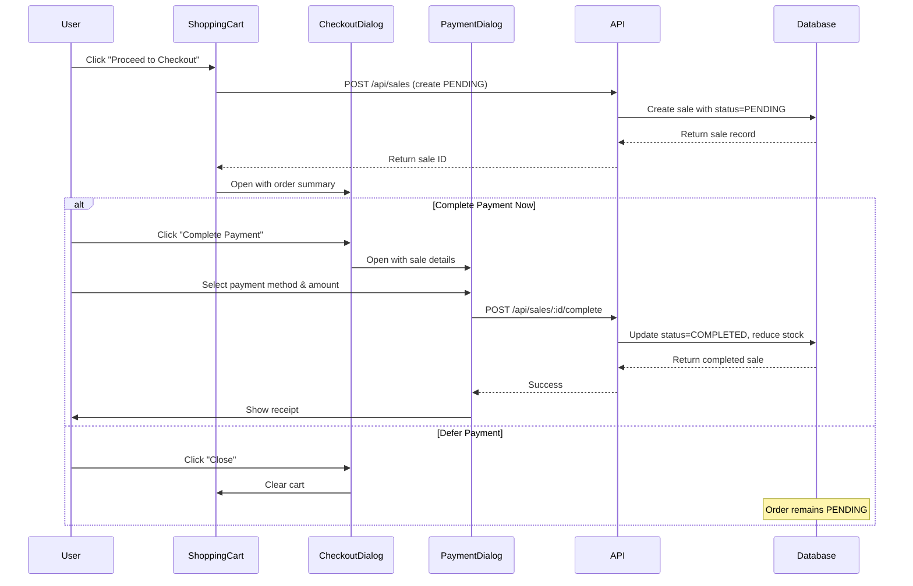

# Design Document

## Overview

This design enhances the checkout flow in the POS system by implementing a two-stage order process. The first stage creates a pending order when the user initiates checkout, and the second stage completes the payment. This approach provides flexibility for cashiers to defer payment processing and improves the handling of exact payment scenarios through a quick-fill feature.

The enhancement modifies the existing checkout workflow by:

1. Creating a PENDING sale record immediately when "Proceed to Checkout" is clicked
2. Displaying a checkout dialog that allows users to either complete payment or defer it
3. Adding a payment dialog with enhanced fields for amount paid and change calculation
4. Providing a quick-fill button to populate exact payment amounts
5. Supporting completion of pending orders from the pending orders list

## Architecture

### Component Structure

```
app/dashboard/sales/new/page.tsx (Modified)
├── ProductSearch (Existing)
├── ShoppingCart (Modified)
├── CheckoutDialog (New)
├── PaymentDialog (New)
├── PendingOrdersList (Modified)
└── ReceiptPrintDialog (Existing)
```

### Data Flow



## Components and Interfaces

### 1. CheckoutDialog Component (New)

A modal dialog that displays order summary after pending order creation and provides options to complete payment or defer.

**Props:**

```typescript
interface CheckoutDialogProps {
	open: boolean;
	onOpenChange: (open: boolean) => void;
	saleId: string;
	items: SaleItem[];
	subtotal: number;
	discount: number;
	tax: number;
	total: number;
	onCompletePayment: (saleId: string) => void;
	onClose: () => void;
}
```

**Responsibilities:**

- Display order summary (items, subtotal, discount, tax, total)
- Provide "Complete Payment" button to open payment dialog
- Provide "Close" button to defer payment and clear cart
- Handle dialog open/close state

### 2. PaymentDialog Component (New)

A modal dialog for completing payment with payment method selection, amount paid input, and change calculation.

**Props:**

```typescript
interface PaymentDialogProps {
	open: boolean;
	onOpenChange: (open: boolean) => void;
	saleId: string;
	total: number;
	onCompleteSale: (
		saleId: string,
		paymentMethod: PaymentMethod,
		amountPaid?: number,
		shouldShowReceipt?: boolean,
	) => void;
	isProcessing: boolean;
}
```

**State:**

```typescript
interface PaymentDialogState {
	paymentMethod: PaymentMethod;
	amountPaid: string;
	changeGiven: number;
	generateReceipt: boolean;
}
```

**Responsibilities:**

- Display order total prominently
- Provide radio buttons for payment method selection (CARD, CASH, MOBILE_MONEY, BANK_TRANSFER)
- Provide "Amount Paid" input field with validation
- Display calculated "Change Given" as read-only field
- Provide quick-fill button to populate amount paid with exact total
- Calculate change automatically when amount paid changes
- Validate that amount paid is a valid number
- Handle payment completion submission
- Show receipt generation checkbox

### 3. Modified ShoppingCart Component

**Changes:**

- Update `onCheckout` handler to create pending order first
- Handle pending order creation success/failure
- Open CheckoutDialog on successful pending order creation
- Display loading state during pending order creation
- Handle error messages from API

### 4. Modified NewSalePage Component

**New State:**

```typescript
const [showCheckoutDialog, setShowCheckoutDialog] = useState(false);
const [showPaymentDialog, setShowPaymentDialog] = useState(false);
const [pendingSaleId, setPendingSaleId] = useState<string | null>(null);
const [pendingSaleData, setPendingSaleData] = useState<PendingSaleData | null>(
	null,
);
```

**New Handlers:**

```typescript
const handleCreatePendingOrder = async () => {
	// Create PENDING sale via API
	// On success: open CheckoutDialog
	// On failure: show error, keep cart intact
};

const handleCompletePayment = (saleId: string) => {
	// Open PaymentDialog with sale details
};

const handleCompleteSale = async (
	saleId: string,
	paymentMethod: PaymentMethod,
	amountPaid?: number,
	shouldShowReceipt?: boolean,
) => {
	// Complete sale via API
	// On success: show receipt, clear cart, refresh pending orders
	// On failure: show error, keep dialog open
};

const handleCloseCheckout = () => {
	// Close CheckoutDialog
	// Clear cart
	// Reset pending sale state
};
```

### 5. Modified PendingOrdersList Component

**Changes:**

- Update "Complete" button handler to open PaymentDialog
- Pass sale details to PaymentDialog
- Refresh list after successful completion

## Data Models

### Sale Model (Existing - No Changes)

The existing Prisma Sale model already supports the required fields:

```prisma
model Sale {
  id            String         @id @default(cuid())
  total         Decimal        @db.Decimal(10, 2)
  status        SaleStatus     @default(PENDING)
  paymentMethod PaymentMethod?
  amountPaid    Decimal?       @db.Decimal(10, 2)
  changeGiven   Decimal?       @db.Decimal(10, 2)
  completedAt   DateTime?
  cancelledAt   DateTime?
  createdAt     DateTime       @default(now())
  updatedAt     DateTime       @updatedAt
  userId        String
  customerId    String?
  items         SaleItem[]
}
```

### Validation Schemas

**Update CompleteSaleSchema:**

```typescript
export const completeSaleSchema = z.object({
	paymentMethod: z.nativeEnum(PaymentMethod, {
		errorMap: () => ({ message: "Invalid payment method" }),
	}),
	amountPaid: z
		.number()
		.nonnegative("Amount paid cannot be negative")
		.max(999999999.99, "Amount is too large")
		.optional()
		.or(
			z
				.string()
				.regex(/^\d+(\.\d{1,2})?$/, "Invalid amount format")
				.transform(Number)
				.optional(),
		),
});
```

**Note:** `amountPaid` is now optional. If not provided, the service will default it to the order total.

##

Correctness Properties

_A property is a characteristic or behavior that should hold true across all valid executions of a system—essentially, a formal statement about what the system should do. Properties serve as the bridge between human-readable specifications and machine-verifiable correctness guarantees._

### Property 1: Pending order creation preserves inventory

_For any_ cart with valid items, when a pending order is created, the inventory stock levels should remain unchanged until the order is completed.

**Validates: Requirements 1.1, 1.4**

### Property 2: Pending order has unique ID

_For any_ pending order created, the system should assign a unique sale ID that does not conflict with existing sale IDs.

**Validates: Requirements 1.5**

### Property 3: Checkout dialog displays complete order summary

_For any_ pending order, when the checkout dialog opens, it should display all required fields: item count, subtotal, discount, tax, and total.

**Validates: Requirements 2.1**

### Property 4: Closing checkout preserves pending order

_For any_ pending order, when the user closes the checkout dialog, the order should remain in the database with PENDING status.

**Validates: Requirements 2.4**

### Property 5: Closing checkout clears cart

_For any_ checkout dialog state, when the user clicks close, the shopping cart should be emptied.

**Validates: Requirements 2.3**

### Property 6: Payment completion updates status

_For any_ pending order with a valid payment method, when payment is completed, the order status should transition to COMPLETED.

**Validates: Requirements 3.4**

### Property 7: Completed sale reduces inventory

_For any_ completed sale, the inventory stock for each item should be reduced by exactly the quantity in the sale.

**Validates: Requirements 3.5**

### Property 8: Change calculation correctness

_For any_ order total and amount paid, the change given should equal the difference (amountPaid - total), which may be negative, zero, or positive.

**Validates: Requirements 4.3, 4.4, 4.5**

### Property 9: Quick-fill sets exact amount

_For any_ order total, when the quick-fill button is clicked, the amount paid field should be populated with exactly the order total value.

**Validates: Requirements 5.2**

### Property 10: Quick-fill idempotence

_For any_ order total, clicking the quick-fill button multiple times should consistently set the amount paid to the same value (the order total).

**Validates: Requirements 5.5**

### Property 11: Default amount paid for missing input

_For any_ payment completion without an amount paid value, the system should default amount paid to the order total.

**Validates: Requirements 6.1, 6.4**

### Property 12: Optional amount paid allows completion

_For any_ valid payment method, the system should successfully complete a sale even when amount paid is not provided.

**Validates: Requirements 6.3**

### Property 13: Pending order completion displays correct total

_For any_ pending order selected from the pending orders list, the payment dialog should display the total that matches the stored sale record.

**Validates: Requirements 7.2**

### Property 14: Pending order completion updates specific record

_For any_ pending order completed from the pending orders list, only that specific sale record should be updated to COMPLETED status, not other pending orders.

**Validates: Requirements 7.3**

### Property 15: Pending order completion preserves cart

_For any_ pending order completed from the pending orders list, the current shopping cart contents should remain unchanged.

**Validates: Requirements 7.4**

### Property 16: Completed order removed from pending list

_For any_ pending order that is completed, it should no longer appear in the pending orders list after completion.

**Validates: Requirements 7.5**

### Property 17: Failed order creation preserves cart

_For any_ cart state, when pending order creation fails, all cart items and user inputs (discount, quantities) should remain unchanged.

**Validates: Requirements 8.2**

### Property 18: Failed payment preserves pending status

_For any_ pending order, when payment completion fails, the order status should remain PENDING.

**Validates: Requirements 8.3**

### Property 19: Stock error messages include item details

_For any_ pending order creation that fails due to insufficient stock, the error message should contain the name of at least one item that is out of stock.

**Validates: Requirements 8.1**

## Error Handling

### Pending Order Creation Errors

1. **Insufficient Stock**: If any item in the cart has insufficient stock, the API returns a 400 error with code `INSUFFICIENT_STOCK` and a message indicating which items are out of stock. The UI displays this error and keeps the cart intact.

2. **Invalid Item**: If any item in the cart no longer exists or has been deleted, the API returns a 404 error with code `NOT_FOUND`. The UI displays an error and suggests refreshing the inventory.

3. **Network Errors**: If the API request fails due to network issues, the UI displays a generic error message with a retry button. The cart remains intact.

### Payment Completion Errors

1. **Sale Not Found**: If the sale ID is invalid or the sale has been deleted, the API returns a 404 error. The UI displays an error and closes the payment dialog.

2. **Invalid Status**: If the sale is not in PENDING status (already completed or cancelled), the API returns a 400 error with code `INVALID_STATUS`. The UI displays an error explaining the sale cannot be completed.

3. **Insufficient Stock at Completion**: If stock levels have changed between pending order creation and completion, the API returns a 400 error with code `INSUFFICIENT_STOCK`. The UI displays an error and keeps the sale in PENDING status.

4. **Validation Errors**: If payment data is invalid (e.g., negative amount paid), the API returns a 400 error with code `VALIDATION_ERROR` and details about which fields are invalid.

### Error Recovery

- All errors during pending order creation keep the cart intact, allowing users to modify and retry
- All errors during payment completion keep the order in PENDING status, allowing users to retry or complete later
- Network errors provide retry buttons for immediate retry
- The UI always displays user-friendly error messages, never raw API errors

## Testing Strategy

### Unit Testing

Unit tests will cover:

1. **Component Rendering**: Verify CheckoutDialog and PaymentDialog render with correct props
2. **Change Calculation**: Test the change calculation logic with various inputs (underpayment, exact payment, overpayment)
3. **Quick-Fill Logic**: Test that quick-fill button correctly populates amount paid field
4. **Default Values**: Test that amount paid defaults to total when not provided
5. **Validation**: Test input validation for amount paid field
6. **Error Display**: Test that error messages are displayed correctly

### Property-Based Testing

Property-based tests will use **fast-check** (JavaScript/TypeScript property testing library) to verify universal properties across many randomly generated inputs.

Each property-based test will:

- Run a minimum of 100 iterations with randomly generated data
- Be tagged with a comment referencing the design document property
- Use the format: `**Feature: enhanced-checkout-flow, Property {number}: {property_text}**`

Property tests will cover:

1. **Inventory Preservation**: Generate random carts, create pending orders, verify stock unchanged
2. **Change Calculation**: Generate random totals and amounts paid, verify change = amountPaid - total
3. **Quick-Fill Consistency**: Generate random totals, click quick-fill multiple times, verify consistent result
4. **Default Amount Paid**: Generate random orders, complete without amount paid, verify defaults to total
5. **Cart Preservation on Error**: Generate random carts, simulate failures, verify cart unchanged
6. **Status Transitions**: Generate random pending orders, complete them, verify status = COMPLETED
7. **Stock Reduction**: Generate random completed sales, verify stock reduced by exact quantities

### Integration Testing

Integration tests will verify:

1. **End-to-End Checkout Flow**: Create cart → create pending order → complete payment → verify receipt
2. **Pending Order Completion**: Create pending order → close dialog → complete from pending list
3. **Error Recovery**: Trigger errors → verify state preservation → retry successfully
4. **Multiple Pending Orders**: Create multiple pending orders → complete them in different order
5. **Concurrent Operations**: Handle multiple users creating/completing orders simultaneously

### Manual Testing Scenarios

1. **Exact Payment with Quick-Fill**: Add items, checkout, use quick-fill, verify change is zero
2. **Overpayment**: Add items, checkout, enter amount greater than total, verify change is positive
3. **Underpayment**: Add items, checkout, enter amount less than total, verify change is negative
4. **Deferred Payment**: Add items, checkout, close dialog, verify order in pending list
5. **Complete Pending Order**: Select pending order, complete payment, verify removed from list
6. **Stock Validation**: Add items with low stock, checkout, verify error if stock insufficient
7. **Multiple Payment Methods**: Test checkout with each payment method (CARD, CASH, MOBILE_MONEY, BANK_TRANSFER)

## Implementation Notes

### State Management

- Use Redux for cart state management (existing)
- Use local component state for dialog open/close states
- Use RTK Query for API calls and cache management
- Pending sale ID stored in component state during checkout flow

### API Changes

**No changes required to existing endpoints.** The current API already supports:

- `POST /api/sales` - Creates PENDING sales
- `POST /api/sales/:id/complete` - Completes PENDING sales
- `GET /api/sales?status=PENDING` - Lists pending orders

**Update validation schema** to make `amountPaid` optional in `completeSaleSchema`.

### Service Layer Changes

**Update `completeSale` function** in `lib/services/sale.service.ts`:

- If `amountPaid` is not provided, default it to `sale.total`
- Calculate `changeGiven` as `amountPaid - sale.total`
- Handle negative change (underpayment) gracefully

### UI/UX Considerations

1. **Loading States**: Show spinners during API calls for pending order creation and payment completion
2. **Disabled States**: Disable buttons during processing to prevent double-submission
3. **Focus Management**: Auto-focus amount paid field when payment dialog opens
4. **Keyboard Support**: Support Enter key to submit payment, Escape to close dialogs
5. **Accessibility**: Ensure all dialogs have proper ARIA labels and keyboard navigation
6. **Mobile Responsiveness**: Ensure dialogs work well on mobile devices

### Performance Considerations

1. **Optimistic Updates**: Update UI immediately, rollback on error
2. **Cache Invalidation**: Invalidate pending orders cache after completion
3. **Debouncing**: Debounce amount paid input to avoid excessive change calculations
4. **Lazy Loading**: Load pending orders list only when needed

## Migration Strategy

This is an enhancement to existing functionality, not a breaking change:

1. **Phase 1**: Add new CheckoutDialog and PaymentDialog components
2. **Phase 2**: Update ShoppingCart to create pending orders on checkout
3. **Phase 3**: Update NewSalePage to handle new checkout flow
4. **Phase 4**: Update PendingOrdersList to use new payment dialog
5. **Phase 5**: Update validation schema and service layer
6. **Phase 6**: Add tests and verify all flows work correctly

**Backward Compatibility**: The existing API endpoints remain unchanged, ensuring no breaking changes for other parts of the system.

## Security Considerations

1. **Authorization**: Verify user has permission to create and complete sales
2. **Validation**: Validate all inputs on both client and server
3. **SQL Injection**: Use Prisma parameterized queries (already in place)
4. **XSS Prevention**: Sanitize all user inputs (React handles this by default)
5. **CSRF Protection**: Use proper CSRF tokens for API requests
6. **Rate Limiting**: Consider rate limiting for sale creation to prevent abuse

## Future Enhancements

1. **Partial Payments**: Support multiple partial payments for a single order
2. **Payment History**: Track all payment attempts for an order
3. **Refunds**: Support refunding completed orders
4. **Split Payments**: Allow splitting payment across multiple methods
5. **Customer Display**: Show order details on a customer-facing display
6. **Receipt Customization**: Allow customizing receipt templates
7. **Email Receipts**: Send receipts via email to customers
